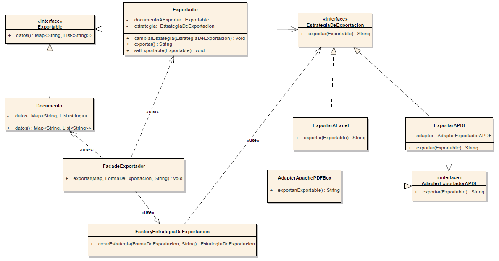

# Módulo exportador de Datos

El presente módulo permite la exportación de datos a PDF y Excel. Los datos deben estar modelados con un Map (un diccionario), donde las claves representan los números de las filas (en string) y los valores representan los datos de las columnas para dicha fila (colección de Strings).
Para la exportación a Excel se utilizó Apache POI y para la exportación a PDF se utilizó Apache PDFBox. La solución está abierta a que dichas bibliotecas puedan ser reemplazadas.
Se recomienda investigar y ejecutar la clase MainExample que está situada dentro de la carpeta Test, package Exportador, para entender el funcionamiento del módulo.

